# About Sarah Arifin

A little more about me

Team meeting • 2026

---

# Quick intro

- Born and raised in Mountain View, California
- Graduated with a bachelor's degree in finance
- Joined ServiceNow in May 2018

---

# Career journey at ServiceNow

**2018 — Internal finance and procurement systems**
- Designed finance and procurement processes and systems
- Focused on internal finance and procurement teams
- Became a certified ServiceNow system administrator

**2020 — Product team**
- Moved to the product team building on the ServiceNow platform
- Helped launch the pilot of legal service delivery

**Procurement product**
- Later moved to procurement product
- Now part of Sourcing and Procurement Operations

---

# How I work with people

- Hands-on, scrappy, and adaptive
- I like experimenting with different approaches until something clicks
- I'm comfortable adjusting as we learn
- I'm honest about what's working and what isn't
- I believe strong products are built through consistent progress, iteration, and improvement

---

# Mottos that guide me

**“Success is the ability to go from one failure to another with no loss of enthusiasm.”**
- I'm persistent and resilient
- Setbacks usually give us signal, not a stop sign

**“Finding meaning in chaos”**
- I like ambiguity when it leads to better structure and clarity
- I enjoy bringing direction to messy or evolving spaces

**“We move together, we win together”**
- Team success matters to me
- I like supporting others, hearing different perspectives, and building collaboratively

---

# Outside of work — Golf

  

    

      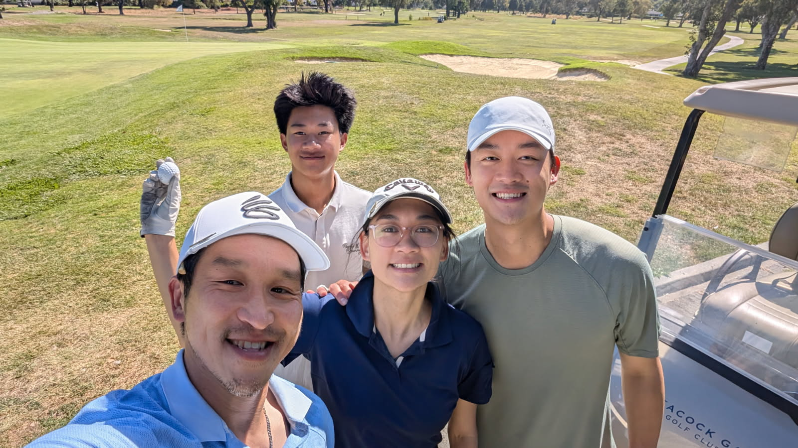
    

    
Golf with the cousins at Peacock Gap Golf Course

  

  

    

      
    

    
Half Moon Bay Ocean Course

  

---

# Outside of work — Golf

  

    

      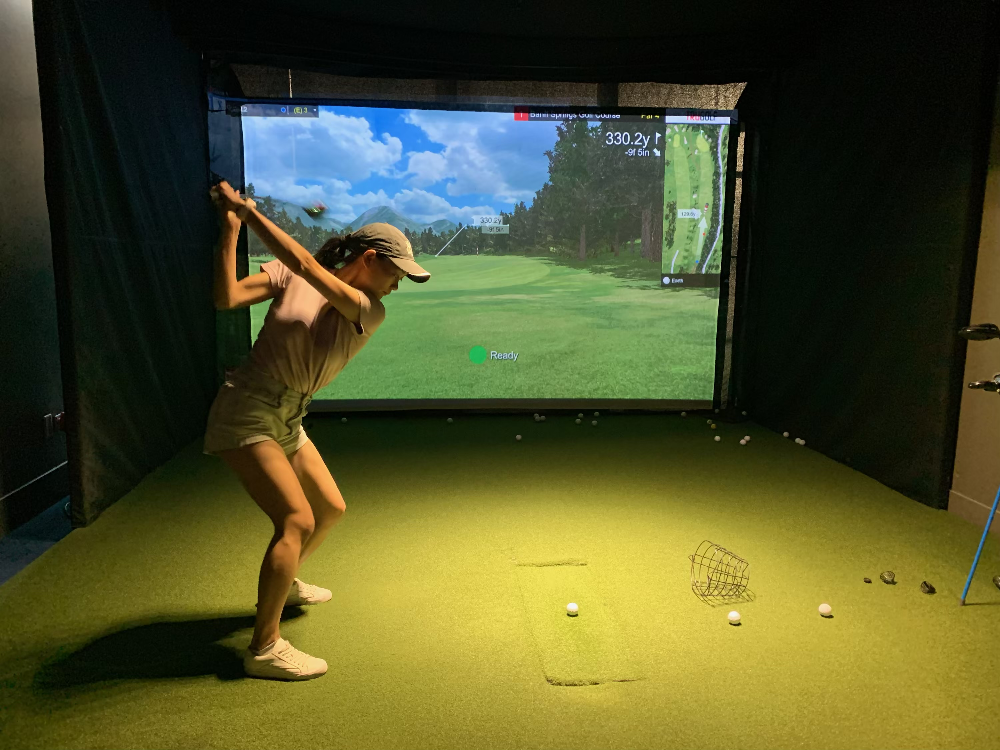
    

    
Golf simulator in ServiceNow India office in Hyderabad

  

  

    

      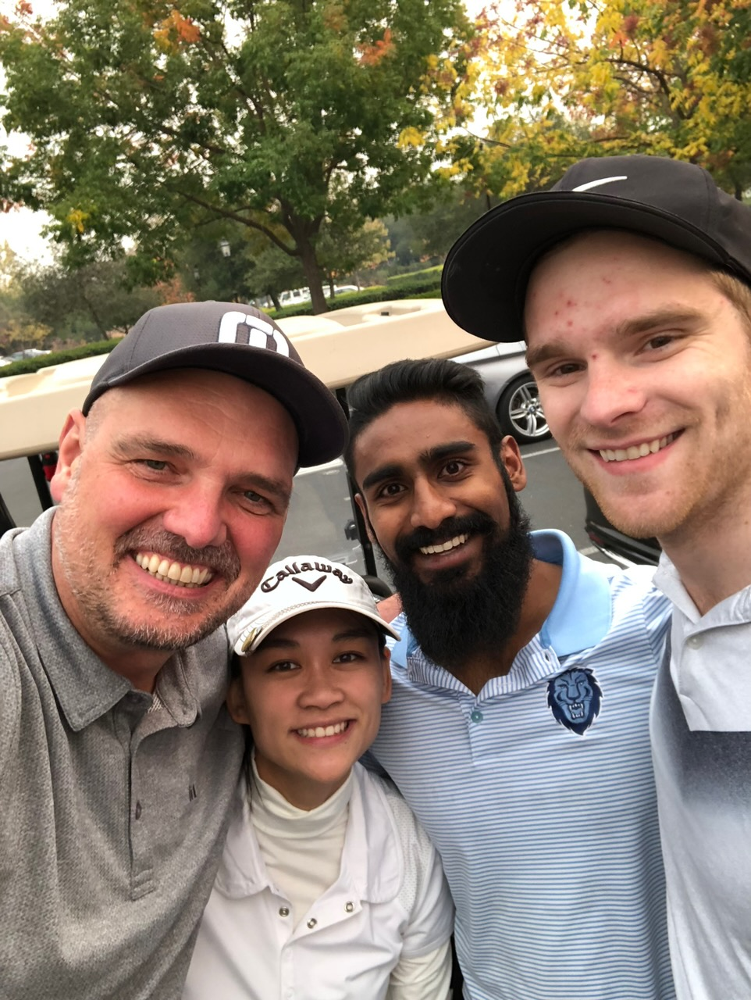
    

    
Golf with former ServiceNow CFO Mike Scarpelli

  

---

# Outside of work — Biking

  

    

      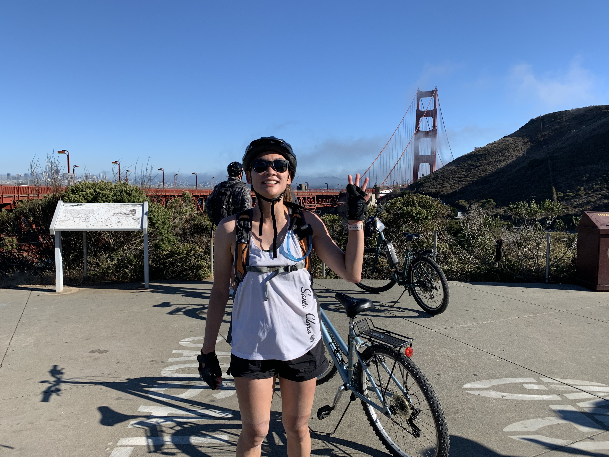
    

    
The three bridges ride

  

  

    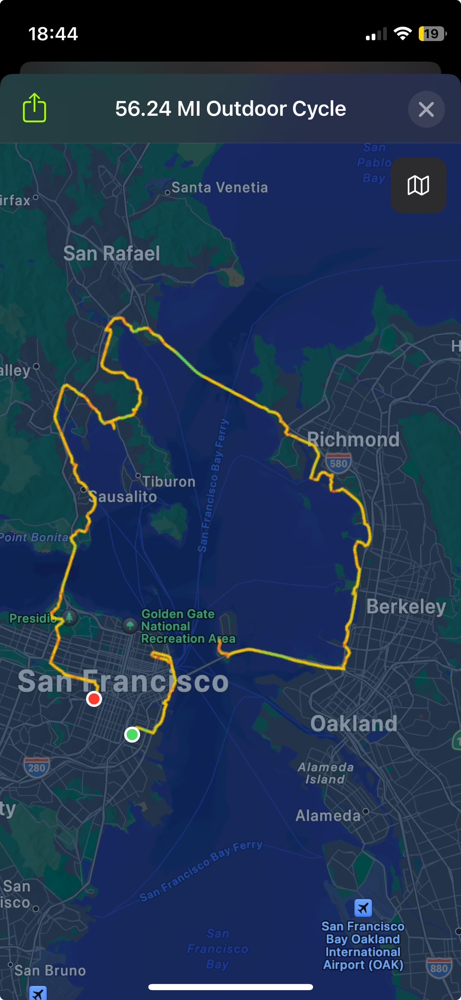
  

---

# Outside of work — Biking

  

    

      

        

          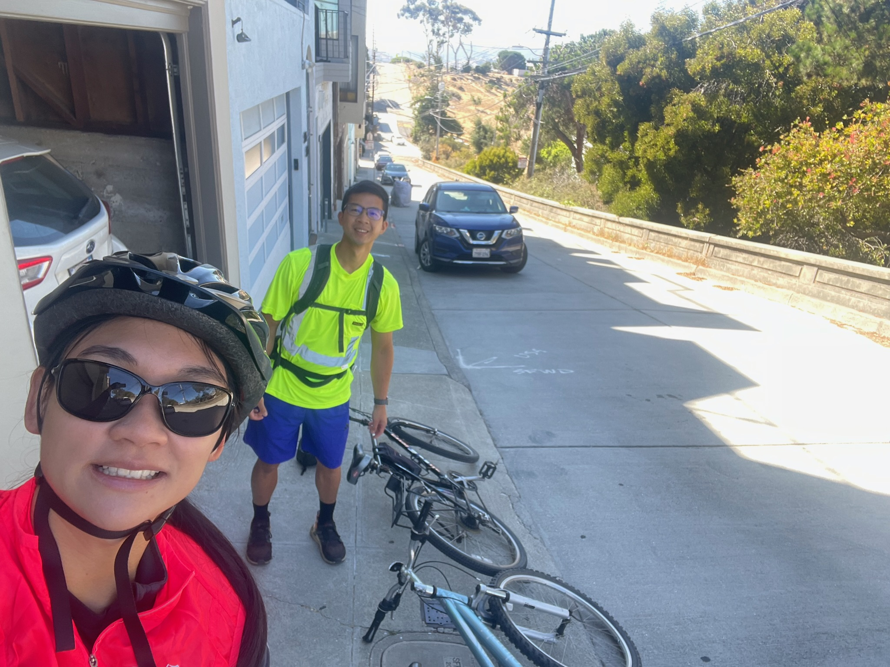
        

        

          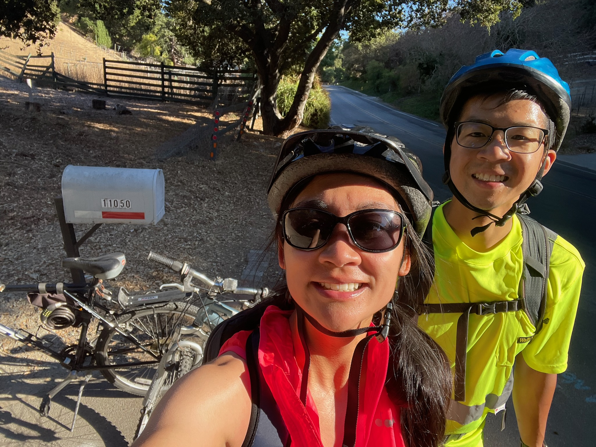
        

      

    

    
Bike ride from SF to Los Altos

  

  

    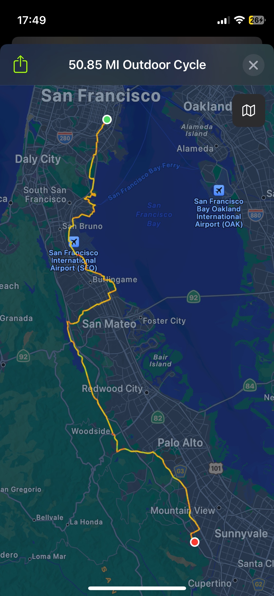
  

---

# Outside of work

  

    <h2 style="margin:0 0 14px 0;">Reading</h2>
    <ul style="margin:0; padding-left: 20px; line-height:1.5; font-size: 18px;">
      <li>One of my favorite ways to recharge and learn</li>
      <li>I'm drawn to ideas, stories, and different perspectives</li>
    </ul>
  

  

    

      

        
        
The Da Vinci Code

      

      

        
        
Wool

      

      

        
        
Harry Potter and the Sorcerer's Stone

      

      

        
        
Steve Jobs

      

    

  

---
layout: two-cols
---

# Outside of work

## Pottery

- I like the tactile, creative side of it
- It's a good reminder that good things take shaping over time

::right::

<video src="https://github.com/winstain13/sarah-about-me-slides/releases/download/media-assets/video-620_singular_display.MOV" style="width:100%; max-height:360px; border-radius:12px;" controls autoplay muted loop playsinline></video>

---
layout: two-cols
---

# Outside of work

## Ceramics

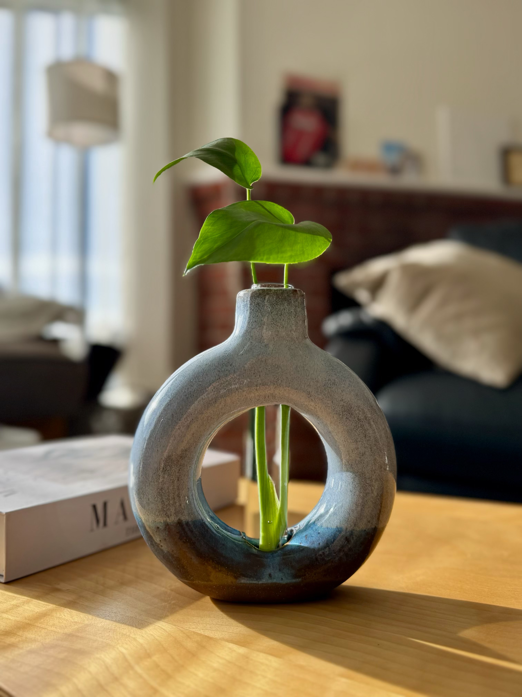

::right::

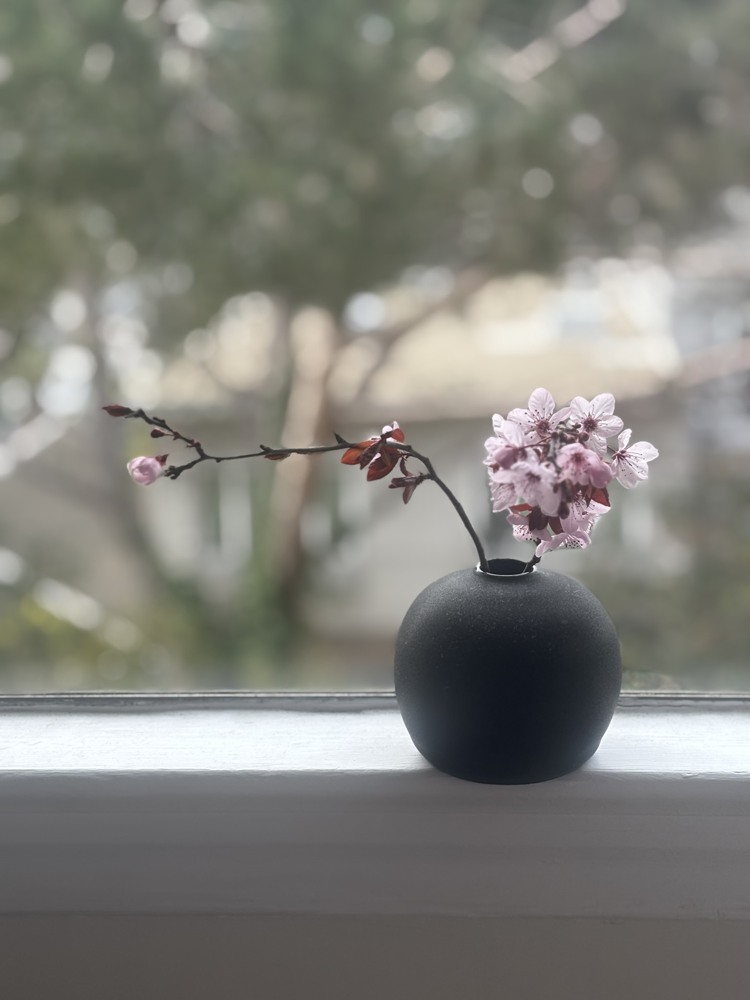

---
layout: two-cols
---

# Places that shaped me

**Lived**
- Mountain View, CA — born and raised
- Chicago — 2020
- San Francisco — 2021 to present

**Places I've especially enjoyed**
- Lisbon
- Amsterdam
- Barcelona
- Venice
- Alaska

**Pattern**
- I almost always love places near the water

::right::

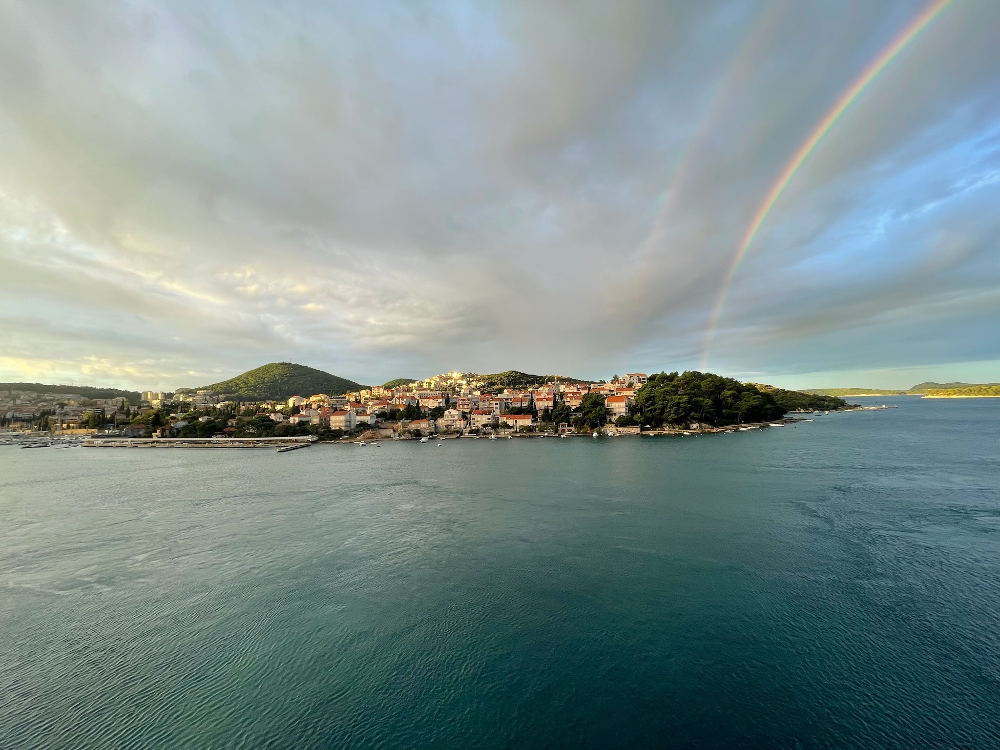

